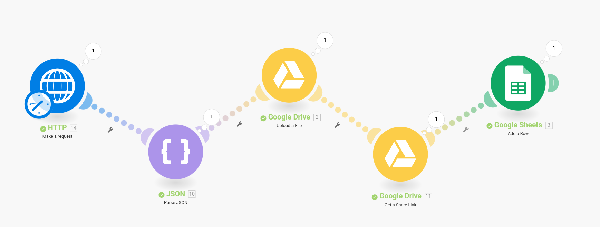

### API de Consulta Pessoa Física no Portal da Transparência

Este projeto expõe uma API REST desenvolvida em Python com FastAPI, que realiza consultas automatizadas no Portal da Transparência do Governo Federal para buscar informações de repasses a cidadãos. A API é protegida com autenticação via Auth0 e foi construída para operar em um fluxo de hiperautomação.

``` bash
├── data
├── exceptions
│   └── scraping_exceptions.py
├── pages
│   └── portal_page.py
├── services
│   ├── auth_service.py
│   └── consulta_service.py
├── main.py
├── .env
├── docker-compose.yaml
├── Dockerfile
├── requirements.txt
├── run.sh
└── README.md
```

### Tecnologias Utilizadas

A stack FastAPI + Uvicorn foi escolhida por oferecer um ambiente simples e fácil de programar, além de oferecer suporte à execução assíncrona utilizando o `Uvicorn`. O Auth0 foi utilizado como provedor de autenticação OAuth2, responsável pela emissão e validação de tokens JWT.

- **[FastAPI](https://fastapi.tiangolo.com/)**
- **[Uvicorn](https://www.uvicorn.org/)** 
- **[Auth0](https://auth0.com/)**

Ferramenta utilizada para automação:

- **[Playwright](https://playwright.dev/python/)**

### API em Produção

A API está atualmente hospedada e disponível publicamente atráves da execução via Docker, o endereço para acesso é:

- http://35.199.80.248:8000/

Para acessar a documentação da API:

- http://35.199.80.248:8000/docs

A infraestrutura escolhida para a hospedagem é a Google Cloud, utilizando uma instância do tipo `n2-standard-2` (2 vCPU, 1 núcleos, 8 GB memória), executando o sistema operacional `Ubuntu 25.04 Minimal`, na região `southamerica-east1` (São Paulo).

Por se tratar de um projeto pequeno, optei pela utilização de uma máquina virtual, pois isso garante recursos fixos e uma cobrança previsível.

| Método | URL                                                                 | Descrição                                                                   |
|--------|---------------------------------------------------------------------|-----------------------------------------------------------------------------|
| GET    | `/`                                                                 | Endpoint simples para verificar se a API está no ar.                        |
| GET    | `/consulta-pessoa-fisica`                                           | Consulta dados de pessoa física                                             |
| GET    | `/get-token`                                                        | Gera token de acesso via chave de API                                       |

O endpoint `/consulta-pessoa-fisica` exige um token JWT válido para ser utilizado. Para gerar esse token, é possível realizar uma requisição do tipo `GET` para a URL `/get-token` da API, informando o `Header` com o nome `x-api-key` e valor `helloworld`. O token será retornado como resposta.

### Hiperautomação com o Make.com

Este projeto faz parte de uma iniciativa maior de **hiperautomação**, que visa automatizar a busca de dados públicos. Com isso, para automatizar as requisições e armazenamento dos dados coletados, foi utilizado o serviço **Make.com**, e nele foi criado o seguinte **workflow**:



#### Etapa 1 | Request HTTP

Uma requisição HTTP contendo o parâmetro identificador é enviada à API, que responde em formato JSON. Este módulo não realiza o parse, apenas envia o JSON bruto para o próximo módulo.

#### Etapa 2 | Parse do JSON Recebido da API

O módulo JSON coleta os dados brutos recebidos do módulo anterior e os converte para o formato `person_data`, que é uma estrutura preparada para armazenar os dados coletados da pessoa física.

#### Etapa 3 | Upload do JSON para o Google Drive

O módulo Google Drive recebe o JSON já estruturado e realiza o upload para o Google Drive. Como a conta utilizada para o upload está sob o domínio `@estudante.ufla.br`, não é possível compartilhar esses dados com pessoas fora desse domínio.

#### Etapa 4 | Coleta do Link do JSON Armazenado no Google Drive

Nesta etapa, o módulo Google Drive extrai o link do arquivo armazenado no Drive na etapa anterior e o envia para o módulo Google Sheets.

#### Etapa 5 | Criação do Registro no Google Sheets

Após receber o link do JSON armazenado no Drive, o módulo Google Sheets cria um novo registro em uma planilha. Este registro contém: identificador único da consulta, nome, CPF, data/hora da consulta e o link direto para o arquivo JSON correspondente no Drive.

### Sobre o Scraping

Para evitar bloqueios por parte do Portal da Transparência e simular a utilização humana, foram utilizados comandos que realizam pausas durante o scraping. Essas pausas variam de 2 a 10 segundos.

O portal da transparência utiliza elementos dinâmicos que exigem controle fino do Playwright, portanto, foi construído um tratamento de exceções específicas e suporte a múltiplos tipos de erro, como:

- `CPFouNISNaoEncontrado`
- `NomeNaoEncontrado`
- `PortalInacessivel`
- `TempoLimiteExcedido`
- `ErroInesperadoDuranteConsulta`